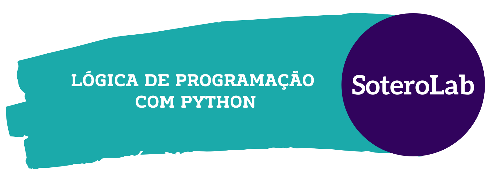

# Que bom que você chegou aqui!

Esse é o repositório do nosso curso e aqui você encontra todo o material que vamos estudar para desenvolver nosso conhecimento em programação a partir da linguagem Python.

## Esse repositório está organizado da seguinte forma:

- [Descrição do Conteúdo Programático](https://github.com/soterolab/curso-python/blob/main/README.md#descri%C3%A7%C3%A3o-do-conte%C3%BAdo-program%C3%A1tico)
> Vale ressaltar que **todos!** os tópicos aqui listados possuem indicações de materiais externos para fortalecer e expandir o nosso conhecimento.
- [Ferramentas utilizadas](https://github.com/soterolab/curso-python/blob/main/README.md#quais-ferramentas-iremos-usar)
- [Glossário e conceitos chave](https://github.com/soterolab/curso-python/blob/main/README.md#gloss%C3%A1rio-e-conceitos-chave)
- [Indicações de materiais de temas relacionados](https://github.com/soterolab/curso-python/blob/main/README.md#indica%C3%A7%C3%B5es-de-materiais-para-estudo-de-temas-relacionados)
- [Cadernos/Notebooks de prática](https://github.com/soterolab/curso-python/tree/main/notebooks)
- [Códigos de prática](https://github.com/soterolab/curso-python/tree/main/codes)

## Quais ferramentas iremos usar?

**1) GitHub - [https://github.com/](https://github.com/)**

**O que é?**  É uma ferramenta usada para publicar, compartilhar e versionar arquivos, como textos e códigos. O GitHub se utiliza do Git para permitir o versionamento de arquivos. É esse versionamento que permite que a gente dê ctrl+z nos projetos, sistemas, textos, sites e etc.

**Por que usar o GitHub?** Porque essa é uma ferramenta muito importante no desenvolvimento de software e muitas vezes é usada para avaliação em processos seletivos.

Caso não tenha, já corre e cria uma conta no GitHub: https://github.com/
- Tutorial de como criar a conta e configurações iniciais: https://youtu.be/1QTi8nIlK1o?t=237 (a interface do GitHub pode estar um pouco diferente, mas os campos a serem preenchidos são os mesmos)
- Tutoriais de como criar chaves GPG e SSH (e porque é importante ativar):
  - [Gerando uma nova chave SSH e adicionando-a ao ssh-agent](https://docs-github-com.translate.goog/pt/authentication/connecting-to-github-with-ssh/generating-a-new-ssh-key-and-adding-it-to-the-ssh-agent?_x_tr_sl=auto&_x_tr_tl=pt&_x_tr_hl=pt-BR&_x_tr_pto=wapp)
  - [Como gerenciar diversas contas do GitHub em uma única máquina com as chaves SSH](https://www.freecodecamp.org/portuguese/news/como-gerenciar-diversas-contas-do-github-em-uma-unica-maquina-com-chaves-ssh/)
- Aqui algumas recomendações para você aprofundar seus estudos em Git - Curso de Git e Github em vídeos:
  - [Git e Github para iniciantes por William Justen](https://youtube.com/playlist?list=PLlAbYrWSYTiPA2iEiQ2PF_A9j__C4hi0A)
  - [COMO USAR GIT E GITHUB NA PRÁTICA! - desde o primeiro commit até o pull request! por Rafaella Ballerini](https://www.youtube.com/watch?v=UBAX-13g8OM)
  - [Curso de Git e GitHub por Guanabara](https://youtube.com/playlist?list=PLHz_AreHm4dm7ZULPAmadvNhH6vk9oNZA)

**2) Jupyter Notebook - [https://jupyter.org/](https://jupyter.org/)**

**O que é?** Uma forma de construir códigos interativos, onde podemos visualizar e executar código, texto, gráficos e animações. Vamos usá-la para programar em Python.

**Os textos no Jupyter Notebook são escritos em Markdown!**
Markdown é um linguagem usada para facilitar a formatação de textos em sites. [Acesse aqui um Guia de comandos/sintaxe Markdown](https://docs.pipz.com/central-de-ajuda/learning-center/guia-basico-de-markdown#open)

**Por que usar o Jupyter Notebook?** Porque esse formato nos permite explorar e descrever tudo o que vamos fazendo passo a passo. E isso facilita o compartilhamento das nossas ideias com outras pessoas.

**3) Google Colab - [https://colab.research.google.com/](https://colab.research.google.com/)**

**O que é?** É uma ferramenta que permite que qualquer pessoa com uma conta do google escreva e execute código Python pelo navegador, e ele se baseia no Jupyter Notebook.

**Por que usar o Google Colab?** Porque isso remove complexidade no nosso estudo, pois não vamos precisar nos preocupar em instalar as ferramentas. Ter um navegador e uma conta no google serão os únicos requisitos necessários para praticarmos as atividades.

**Quando não usar o Google Colab?** Quando a sua atividade incluir dados que não sejam públicos, que devem ser protegidos pela LGPD e/ou sejam informações confidenciais da sua empresa ou organização. 

- [1º Como usar o Google Colab?](https://www.youtube.com/watch?v=7OUGVn7sbTQ)
- [2º Como publicar as nossas alterações do Google Colab para o Github?](https://www.youtube.com/watch?v=ZDhIqvNgY2s)
- [3º Atualizando um repositório *fork* com as alterações feitas no repositório *original*](https://www.youtube.com/watch?v=hXtHGSYfUOo)

## Descrição do Conteúdo Programático:

**Os materiais centrais de referência desse curso são:**

- [Ó Py Ó - Grupo de Estudos do PyLadies Salvador](https://github.com/PyLadiesSalvador)
- [Livro Pense em Pyhon de de Allen B. Downey](https://penseallen.github.io/PensePython2e/)
- [Canal Programação Dinâmica | Kizzy Terra e Hallison Paz](https://www.youtube.com/programacaodinamica)
- [Curso em Video - Python | Professor Gustavo Guanabara](https://www.youtube.com/watch?v=S9uPNppGsGo&list=PLvE-ZAFRgX8hnECDn1v9HNTI71veL3oW0)
- [Livro Introdução à Programação com Python de Nilo Ney Coutinho Menezes - Exercícios Resolvidos](https://python.nilo.pro.br/exercicios3/index.html)

O livro [How to Think Like a Computer Scientist de Jeffrey Elkner, Allen B. Downey e Chris Meyers](https://www.openbookproject.net/thinkcs/python/english2e/index.html) também é uma ótima forma de reforçar os conhecimentos e estimular a leitura em inglês.

### 1º Dia de ambientação com as ferramentas e introdução ao interpretador Python

- 1º Perguntas de OrientAção:
    - [ Por que entender algoritmos e aprender programação?](https://youtu.be/-omDeXEli4A)
    - [Qual é o ciclo de vida de um programa?](https://youtu.be/Dlcna6peoms)

- 2º Tutoriais de Instalação do Python | Python Brasil
    - [Instalação para o Sistema Operacional Linux](https://python.org.br/instalacao-linux/)
    - [Instalação para o Sistema Operacional Windows](https://python.org.br/instalacao-windows/)
    - [Instalação para o Sistema Operacional MAC](https://python.org.br/instalacao-mac/)
    - Ferramentas para escrevermos nossos códigos:
        - [Indicações de ferramentas de apoio no desenvolvimento em Python | Python Brasil](https://python.org.br/ferramentas/)
- 3º história e contexto:
    - [História do Python | PyLadies BH](https://medium.com/pyladiesbh/python-hist%C3%B3ria-3e6272fcce6c)
    - [PEP 8 - Guia de Estilo Para Python | Tradução na página do Python Brasil](https://wiki.python.org.br/GuiaDeEstilo)
    - [Python para front end](https://www.hashtagtreinamentos.com/frontend-com-python)
    - [Zen of Python com Exemplos | Python Academy](https://pythonacademy.com.br/zen-of-python)
    - [O Zen do Python Comentários sobre o PEP 20 — Zen of Python | Bruno Oliveira](https://medium.com/internet-das-coisas/o-zen-do-phyton-235d6aab0b94)
    - História da computação:
        - [A história do ENIAC, o primeiro computador do mundo | Tecnoblog por João Brunelli Moreno](https://tecnoblog.net/especiais/eniac-primeiro-computador-do-mundo-completa-65-anos/)
        - [Quem inventou o computador? | Tecnoblog por Ronaldo Gogoni](https://tecnoblog.net/responde/quem-inventou-o-computador/)
        - [O Que é CLI? Explicamos a Interface de Linhas de Comando | Hostinger por Andrei L.](https://www.hostinger.com.br/tutoriais/o-que-e-cli#Shell_-_A_Base_do_CLI)
    - Iniciativas importantes:
        - [AfroPython](https://www.instagram.com/afropython/)
        - [PretaLab](https://www.pretalab.com/)
        - [PyLadies Salvador](https://github.com/PyLadiesSalvador)

### 2º Variáveis e tipos básicos de dados

- **Capítulo 1**: [A jornada do programa | PensePython2e](https://penseallen.github.io/PensePython2e/01-jornada.html)
- **Capítulo 2**: [Variáveis, expressões e instruções | PensePython2e](https://penseallen.github.io/PensePython2e/02-vars-expr-instr.html)

- **Tópicos abordados**:
  - Formas de executar Python
  - Variáveis (Atribuição, nomenclatura)
  - Tipos de dados
  - Expressões e instruções
  - Ordem das operações
  - Operações de Strings
  - Comentários
  - Erros comuns
  
- **Materiais de apoio**:
  1. [Operando com Números em Python | Programação Dinâmica](https://www.youtube.com/watch?v=hysCU5CWl80)
  2. [O que é e como se utiliza uma variável? | Programação Dinâmica](https://www.youtube.com/watch?v=tZ-3EGw5IPw)
  3. [Primeiros passos no Python: Um tour pela linguagem | DevMedia](https://www.devmedia.com.br/python-tutorial-tour-pela-linguagem/40646)
  4. [Workshop de Python com DOJO - Pyladies Rio de Janeiro e Pyladies Caxias](https://github.com/PyLadiesRio/workshop-python)
      - Começe pelo arquivo de sumário ([SUMMARY.md](https://github.com/PyLadiesRio/workshop-python/blob/master/SUMMARY.md))
      - E em seguida pelo [arquivo de que explica o que é um DOJO](https://github.com/PyLadiesRio/workshop-python/blob/master/regras_dojo.md)
      - Para exercitar o conteúdo dessa sessão faça as atividades que estão em DOJO 1, DOJO 2, DOJO 3 e DOJO 4.
  5. [Formatação de Strings - Python String Format Cookbook | Marcus Kazmierczak](https://mkaz.blog/working-with-python/string-formatting/)
      
### 3º Condicionais

- **Capítulo 5**: [Condicionais | PensePython2e - **apenas até o tópico 5.7 - Condicionais aninhadas)**](https://penseallen.github.io/PensePython2e/05-cond-recur.html)

- **Tópicos abordados**:
  - Expressões booleanas
  - Operadores lógicos
  - Execuções condicionais (If)
  - Execução alternativa (else)
  - Condições aninhadas

- **Materiais de apoio**:
  1. [Comparando Números | Programação Dinâmica](https://www.youtube.com/watch?v=pB0UeU7SIo0)
  2. [Analisando Condições em Python | Programação Dinâmica](https://www.youtube.com/watch?v=HquOtDNB608)
  3. [Condições (Parte 1) | Curso em Vídeo](https://www.youtube.com/watch?v=K10u3XIf1-Q)

### 4º Laços de repetição

- **Curso Python 013**: [Estrutura de repetição for | Curso em Vídeo](https://www.youtube.com/watch?v=cL4YDtFnCt4&ab_channel=CursoemV%C3%ADdeo)
- **Capítulo 7**: [Interação | PensePython2e](https://penseallen.github.io/PensePython2e/07-iteracao.html)
- **Capítulo 8**: [Strings | PensePython2e](https://penseallen.github.io/PensePython2e/08-strings.html)

- **Tópicos abordados**:
  - Reatribuição
  - Instrução While, break e for
  - Strings (cadeia de caracteres)
  - Fatiamento de strings

- **Materiais de apoio**:
  1. [Strings e Criptografia | Programação Dinâmica](https://www.youtube.com/watch?v=COtUf6E5U3M)

### 5º Laços de repetição, Listas & Dicionários

- **Capítulo 10**: [Listas | PensePython2e](https://penseallen.github.io/PensePython2e/10-listas.html)
- **Capítulo 11**: [Dicionários | PensePython2e](https://penseallen.github.io/PensePython2e/11-dicionarios.html)

- **Tópicos abordados**:
  - Reforçando laços de repetição
  - Listas
  - Dicionários

- **Materiais de apoio**:
  1. [Repetições em Python I - Iterações Definidas | Programação dinâmica](https://www.youtube.com/watch?v=H3uppJ2XU9Y)
  2. [Repetições em Python II — Iterações Condicionais | Programação dinâmica](https://www.youtube.com/watch?v=3nkdjBE3Xlo)
  3. [LISTAS em PYTHON | Programação dinâmica](https://www.youtube.com/watch?v=Mjl1O9ANFrI)

- **Extra**:
  - [O que são Tuplas em Python | Didática Tech](https://www.youtube.com/watch?v=BVNGvpK9VoA)

### 6º Funções e parâmetros

- **Capítulo 3**: [Funções | PensePython2e](https://penseallen.github.io/PensePython2e/03-funcoes.html)
- **Capítulo 6**: [Funções com resultado | PensePython2e - **apenas tópicos _6.1 - Valores de retorno_ e _6.9 - Depuração_**)](https://penseallen.github.io/PensePython2e/06-funcoes-result.html) 

- **Tópicos abordados**:
  - Funções
  - Parâmetros
  - Funções com resultado
  - Depuração

- **Materiais de apoio**:
  1. [Funções em Python | Programação Dinâmica](https://www.youtube.com/watch?v=7hJntZxux0M)
  2. [Relembrando tipos de dados: Conhecendo Tipos de Dados em Python | Programação Dinâmica](https://www.youtube.com/watch?v=EosATvOIHEs)

### 7º Interpretação de erros

- **Apêndice A: Depuração**: [Apêndice A: Depuração | PensePython2e](https://penseallen.github.io/PensePython2e/A-depuracao.html)

- **Tópicos abordados**:
  - Erros de sintaxe
  - Erros de tempo de execução
  - Erros semânticos

- **Materiais de apoio**:
  1. [Erros e exceções | Documentação oficial do Python](https://docs.python.org/pt-br/3/tutorial/errors.html)
  2. [Tratamento de erros e exceções no Python com try/except | | Python Academy por Vinícius Ramos](https://pythonacademy.com.br/blog/tratamento-erros-excecoes-no-python)

## Glossário e Conceitos Chave

#### Documentação Python: https://docs.python.org/pt-br/3/tutorial/
O termo Documentação dentro da área de tecnologia significa um local que reúne todas as informações sobre como usar a ferramenta em questão. Seja ela uma linguagem de programação, biblioteca - qualquer coisa que você está querendo saber como funciona.

#### Guia de estilo para Python:
São recomendações sobre como escrever o nosso código de forma que ele fique mais organizado e inteligível por outras pessoas.
- **Original em Inglês:** https://peps.python.org/pep-0008/
- **Tradução na página do Python Brasil:** https://wiki.python.org.br/GuiaDeEstilo

#### Biblioteca *(No contexto de Programação)*
Uma forma de entendermos o termo Bibliotecas na área de programação é pensá-lo como uma caixinha que reúne ferramentas que nós gostaríamos de utilizar para resolver um problema. Sendo que nós não vamos precisar construir essa ferramenta porque ela já foi feita e muito bem testada por outras pessoas - vamos poder simplesmente reusar aquilo.
- [Bibliotecas interessantes em Python](https://www.hashtagtreinamentos.com/bibliotecas-mais-importantes-do-python)

#### Framework
E podemos entender Framework da mesma forma que entendemos Biblioteca. Só que o framework é uma caixa beeeeem maior e que nos permite fazer coisas mais complexas.

- [O que é framework em programação + 8 mais usados | TERA](https://blog.somostera.com/desenvolvimento-web/o-que-eframework) 

#### Sintaxe e Semântica: 
Em programação a **Sintaxe** representa as regras que a gente precisa seguir para que a nossa mensagem seja entendida pelo nosso ouvinte. Então se vamos escrever um programa em Python, temos que respeitar a Sintaxe do Python. Se queremos escrever um texto em Markdown, vamos precisar seguir a Sintaxe do Markdown.

Já a **Semântica** da linguagem de programação trata do significado das expressões usadas na respectiva linguagem, é o que vai garantir que o print() deve imprimir a variável que lhe foi passada ao invés elevar ela ao quadrado, por exemplo. Semântica também é a relação entre o que gostaríamos que o código fizesse e o que de fato escrevemos para ele fazer.
- [Qual a diferença entre sintaxe e semântica?](https://kenzie.com.br/blog/valor-semantico/)

#### Paradigmas de Programação

- [Paradigmas de programação: o que são e quais os principais? | Cairo Noleto em Trybe](https://blog.betrybe.com/tecnologia/paradigmas-de-programacao/)

#### Arquitetura WEB

- [O Modelo Cliente Servidor | GTA UFRJ](https://www.gta.ufrj.br/ensino/eel878/redes1-2016-1/16_1/p2p/modelo.html)

## Indicações de Materiais para Estudo de Temas Relacionados

### API
- [Introdução a API com Flask | PyLadies Salvador](https://github.com/PyLadiesSalvador/intro-api)

### Análise, Ciência e Visualização de Dados
-  [ O QUE É UM BANCO DE DADOS? | Computação para Curiosos  | Programação Dinâmica - Kizzy Terra](https://www.youtube.com/watch?v=P6uiLQ6F7Mo&list=PL5TJqBvpXQv4m5Uhe5Veq2alDwd_JIJOu&index=1&pp=iAQB)
-  [SQL é importante para Cientista de Dados? Por que aprender SQL? | Programação Dinâmica - Kizzy Terra](https://youtu.be/vyTA2uG0uX8?list=PL5TJqBvpXQv4m5Uhe5Veq2alDwd_JIJOu)
-  [Curso Básico de SQL para Análise de Dados | Programação Dinâmica - Kizzy Terra](https://www.youtube.com/playlist?list=PL5TJqBvpXQv5n1N15kcK1m9oKJm_cv-m6)
- [Visualização de Dados (Pós da Computação@UFCG) | Nazareno Andrade](https://www.youtube.com/watch?v=L6b8RBrB-n4&list=PLvvIUEwTZK9wJ0XnUtW6prMVeDx8QIXCN)
- [Ciência de Dados Descritiva | Nazareno Andrade](https://www.youtube.com/watch?v=x5A6xTTvNQw&list=PLvvIUEwTZK9yHJ4R2CCrKqITW9GrFNSig)

### Entrevista Técnica

- [Resolvendo questões de entrevistas técnicas do GOOGLE | PROBLEMA TÉCNICO #01 | Live Coding - Hallison Paz](https://youtu.be/-VpH54mhSu4?list=PL5TJqBvpXQv4Fs0jYmFUKsBUpyfefUuJp)

### Classes e Objetos

- [Classes e objetos | PensePython2e](https://penseallen.github.io/PensePython2e/15-classes-objetos.html)
- [Classes e funções | PensePython2e](https://penseallen.github.io/PensePython2e/16-classes-funcoes.html)
- [O que é um Objeto? | Programação Dinâmica](https://www.youtube.com/watch?v=gJC02P6jkRM)
- [Classes | Programação Dinâmica](https://www.youtube.com/watch?v=9nWMXIXNGdU)
- [Paradigmas de Programação | Código Fonte TV](https://www.youtube.com/watch?v=EefVmQ2wPlM)

### Classes e Herança

- [Classes e métodos | PensePython2e](https://penseallen.github.io/PensePython2e/17-classes-metodos.html)
- [Herança | PensePython2e](https://penseallen.github.io/PensePython2e/18-heranca.html)
- [O que é um Objeto? | Programação Dinâmica](https://www.youtube.com/watch?v=gJC02P6jkRM)
- [Classes | Programação Dinâmica](https://www.youtube.com/watch?v=9nWMXIXNGdU)
- [Representando Objetos em Strings | Programação Dinâmica](https://www.youtube.com/watch?v=ei9-eCyon7I)
- [Sobrecarga de Operadores | Programação Dinâmica](https://www.youtube.com/watch?v=RlFcUIVZGXM)
